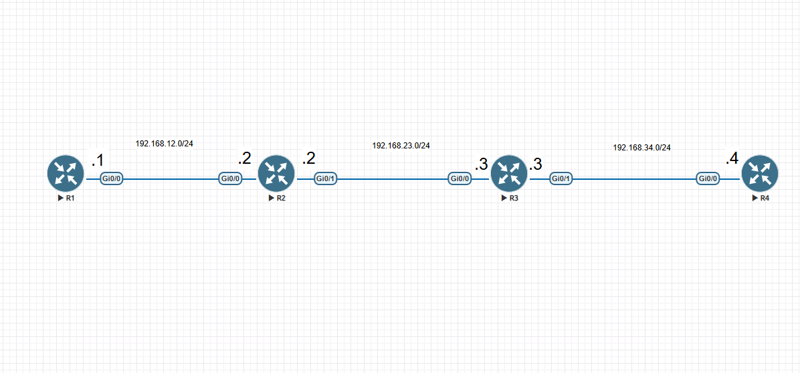
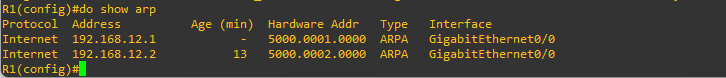

# ARP Lab

## Lab Overview

This lab focuses on **Address Resolution Protocol (ARP)** behavior in a routed network.

The lab demonstrates ARP debugging, packet capture, static routing, ARP table examination, ARP timeout configuration, and analysis of ARP exchanges using Wireshark.

---

## Lab Topology



### Network Addressing

The lab uses `/24` subnets based on the router numbers:

| Link    | Network         | Router Addresses                   |
| ------- | --------------- | ---------------------------------- |
| R1 - R2 | 192.168.12.0/24 | R1: 192.168.12.1, R2: 192.168.12.2 |
| R2 - R3 | 192.168.23.0/24 | R2: 192.168.23.2, R3: 192.168.23.3 |
| R3 - R4 | 192.168.34.0/24 | R3: 192.168.34.3, R4: 192.168.34.4 |

---

# Lab Objectives

* Debug ARP messages on R1 and R2.
* Capture traffic on the R1-R2 link.
* Configure static routes on R1.
* Observe ARP behavior when communicating with directly connected and remote networks.
* Examine the ARP table on R1.
* Change the ARP timeout on R1.
* Analyze ARP exchanges using Wireshark.

---

# Lab Tasks

## Task 1 - Debug ARP Messages

Enable ARP debugging on **R1 and R2**.

Additional configuration may be required to display debug messages through the console connection.

---

## Task 2 - Capture Packets

Start a packet capture on the **R1-R2 link**.

The packet capture should contain enough packets to analyze the ARP exchanges.

Recommended:

* Increase the maximum packet count to more than 50.

### Packet Capture

The capture is available as:

`arp-packet-capture.pcapng`

Open the capture with **Wireshark**.

---

## Task 3 - Configure Static Routes on R1

Configure two static routes on R1.

### Recursive Route

Configure a recursive static route to:

```text
192.168.23.0/24
```

### Directly Connected Route

Configure a directly connected static route to:

```text
192.168.34.0/24
```

---

## Task 4 - Ping R2

From R1, ping the G0/0 interface of R2.

```text
ping 192.168.12.2
```

Observe the ARP debug output.

### Question

Does R1 generate any new ARP debug output?

---

## Task 5 - Ping R3

From R1, ping R3's G0/0 interface.

```text
ping 192.168.23.3
```

Observe the ARP debug output.

### Question

Does R1 send an ARP request?

Why or why not?

---

## Task 6 - Ping R4

From R1, ping R4's G0/0 interface.

```text
ping 192.168.34.4
```

### Questions

* Why does the ping fail?
* Fix the issue.
* Ping R4 again.

---

## Task 7 - Examine the ARP Table

Examine R1's ARP table.

```bash
show arp
```

### Verification

The ARP table can be verified using:

```bash
show arp
```



---

## Task 8 - Change ARP Timeout

Change the ARP timeout on R1's G0/0 interface to **3 minutes**.

### Question

After how much time will R1 attempt to refresh R2's ARP entry?

---

## Task 9 - Analyze ARP with Wireshark

Open:

```text
arp-packet-capture.pcapng
```

in Wireshark.

Examine each ARP exchange in the packet capture.

Look for:

* ARP Requests
* ARP Replies
* Source MAC addresses
* Destination MAC addresses
* Source IP addresses
* Destination IP addresses

---

# Verification Commands

## Display ARP Table

```bash
show arp
```

## Display Interface Information

```bash
show ip interface brief
```

## Display Routing Table

```bash
show ip route
```

## Test Connectivity

```bash
ping 192.168.12.2
```

```bash
ping 192.168.23.3
```

```bash
ping 192.168.34.4
```

---

# Packet Capture

The Wireshark capture was taken on the **R1-R2 link**.

File:

```text
arp-packet-capture.pcapng
```

Use Wireshark to examine the ARP exchanges generated during the lab.

---

# Lab Files

```text
02-ARP/
│
├── README.md
├── topology.png
├── arp-packet-capture.pcapng
├── verification-show-arp.png
├── lab-instructions.txt
│
└── Configurations/
    ├── R1-running-config.txt
    ├── R2-running-config.txt
    ├── R3-running-config.txt
    └── R4-running-config.txt
```

---

# Key Topics

* Address Resolution Protocol (ARP)
* ARP Request
* ARP Reply
* ARP Table
* ARP Debugging
* Static Routing
* Recursive Static Route
* Directly Connected Static Route
* ARP Timeout
* Wireshark Packet Analysis

---

# Lab Questions

1. Does R1 generate new ARP debug output when pinging R2?
2. Does R1 send an ARP request when pinging R3? Why?
3. Why does the initial ping to R4 fail?
4. What needs to be fixed to successfully ping R4?
5. What entries are present in R1's ARP table?
6. After changing the ARP timeout to 3 minutes, when will R1 attempt to refresh R2's ARP entry?
7. What ARP exchanges can be identified in the Wireshark capture?

---

# Author

**Rahul Bhattarai**

CCNP Enterprise Study Repository

**Lab:** ARP

