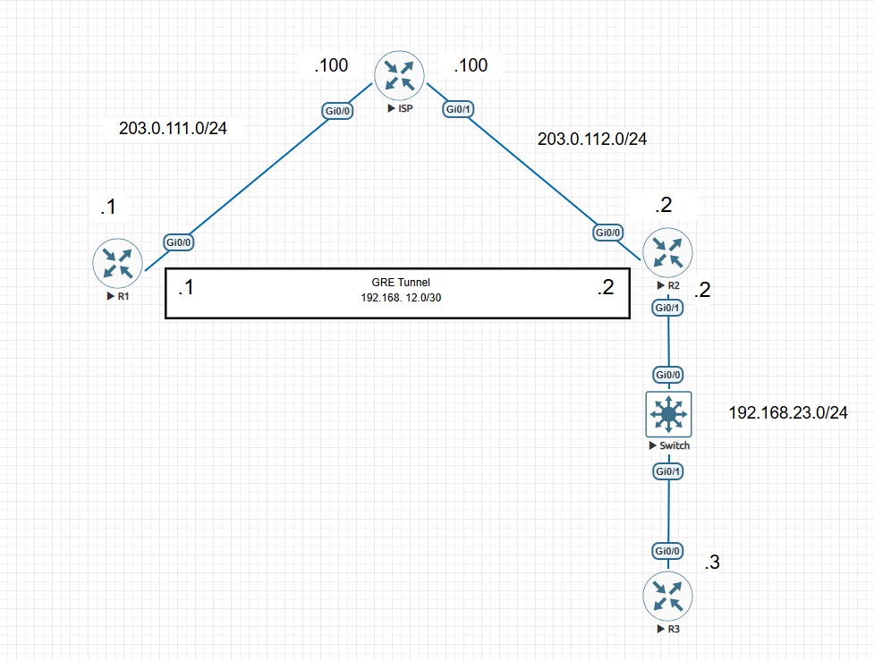
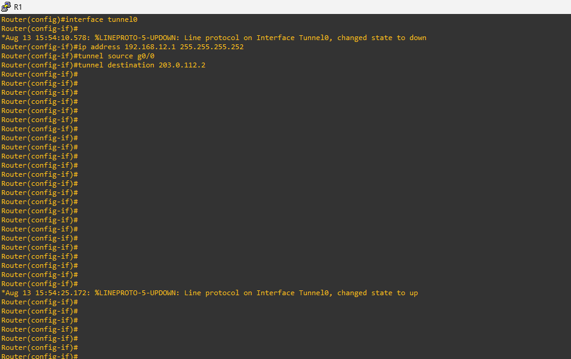
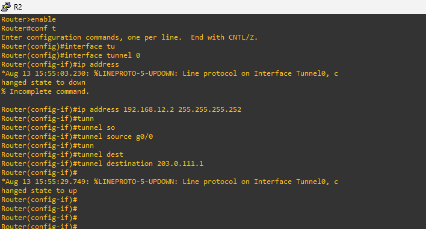
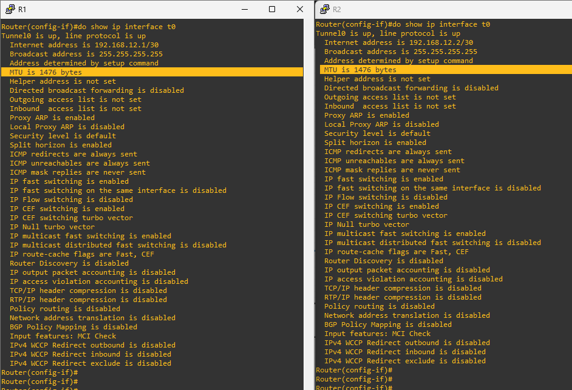
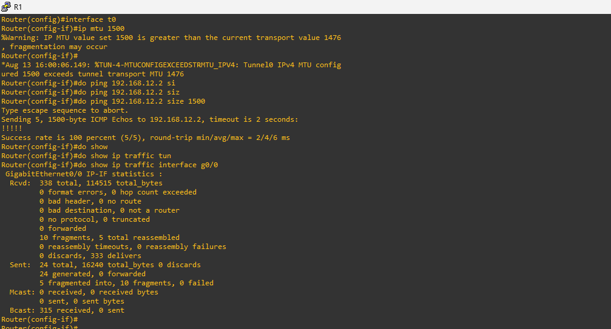
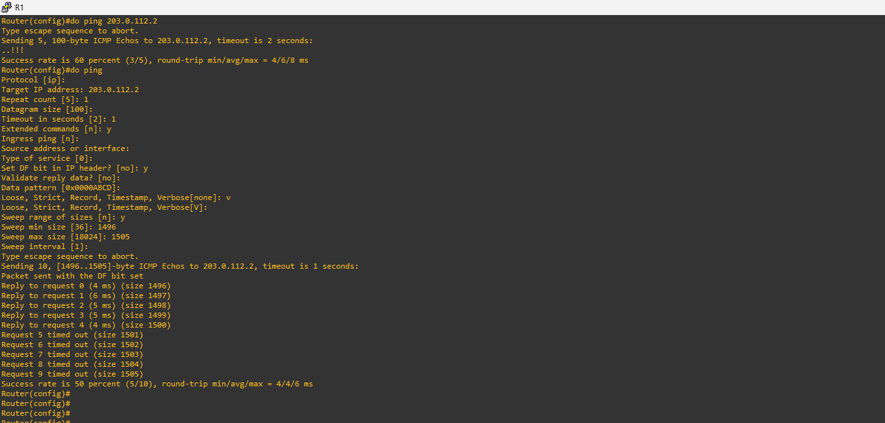
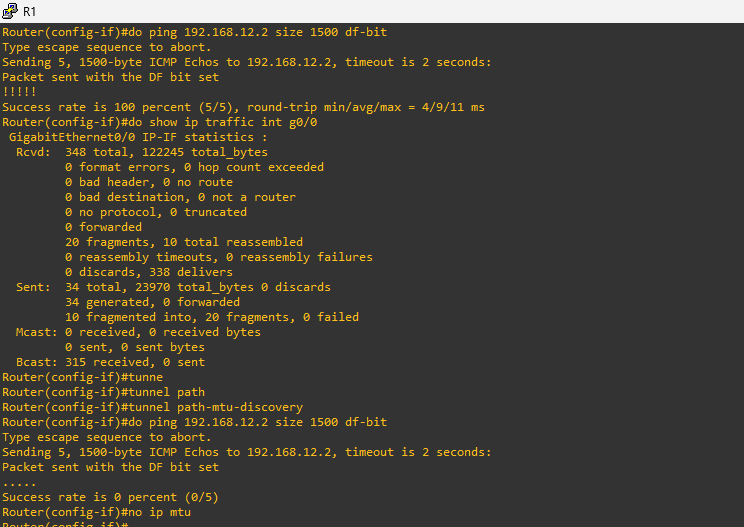

# MTU and GRE Tunnel Lab

## Lab Overview

This lab explores **IP MTU, GRE tunneling, packet fragmentation, and the DF (Don't Fragment) bit**.

The lab begins with extended ping testing between R1 and R2, followed by GRE tunnel configuration. The tunnel MTU is then modified to observe fragmentation behavior and troubleshoot connectivity between R1 and R3.

---

# Lab Topology



---

# Network Addressing

| Network    | Device | Address          |
| ---------- | ------ | ---------------- |
| R1 - ISP   | R1     | 203.0.111.1/24   |
| R1 - ISP   | ISP    | 203.0.111.100/24 |
| R2 - ISP   | R2     | 203.0.112.2/24   |
| R2 - ISP   | ISP    | 203.0.112.100/24 |
| R2 - R3    | R2     | 192.168.23.2/24  |
| R2 - R3    | R3     | 192.168.23.3/24  |
| GRE Tunnel | R1     | 192.168.12.1/30  |
| GRE Tunnel | R2     | 192.168.12.2/30  |

The addressing information follows the supplied lab instructions.

---

# Lab Objectives

* Understand IP MTU behavior.
* Perform extended ping testing.
* Understand the DF bit.
* Configure a GRE tunnel.
* Examine GRE tunnel MTU.
* Configure tunnel interface MTU.
* Observe packet fragmentation.
* Troubleshoot MTU-related connectivity problems.
* Verify traffic using Cisco IOS commands.

---

# Task 1 - Extended Ping from R1 to R2

Perform an extended ping from R1 to R2.

The lab requires:

* DF-bit enabled.
* Packet sizes swept from **1496 bytes to 1505 bytes**.
* Identification of which packet sizes succeed and which fail.

Example:

```bash
ping
```

Use the extended ping options to configure the required packet sizes and DF-bit behavior.

### Questions

* Which packet sizes succeed?
* Which packet sizes fail?
* Why do the larger packets fail?

---

# Task 2 - Configure GRE Tunnel

Configure a GRE tunnel between R1 and R2.

### GRE Tunnel Addressing

```text
R1 Tunnel0: 192.168.12.1/30
R2 Tunnel0: 192.168.12.2/30
```

### R1

```bash
interface Tunnel0
 ip address 192.168.12.1 255.255.255.252
 tunnel source GigabitEthernet0/0
 tunnel destination 203.0.112.2
```

### R2

```bash
interface Tunnel0
 ip address 192.168.12.2 255.255.255.252
 tunnel source GigabitEthernet0/0
 tunnel destination 203.0.111.1
```

## The supplied R1 and R2 configurations confirm these GRE tunnel parameters.

# Task 3 - Examine Tunnel MTU

Verify the tunnel interface.

```bash
show ip interface tunnel0
```

Check the reported IP MTU.

The lab specifically asks:

> What is the IP MTU of the tunnel interface?

---

# Task 4 - Configure Tunnel MTU to 1500

Configure the IP MTU of the tunnel interface to **1500 bytes** on both R1 and R2.

```bash
interface Tunnel0
 ip mtu 1500
```

Verify:

```bash
show ip interface tunnel0
```

---

# Task 5 - Test R1 to R2 Tunnel Connectivity

From R1, ping R2's tunnel interface using a packet size of **1500 bytes** without the DF bit.

```bash
ping
```

Then repeat the test with the **DF bit enabled**.

Compare the results.

### Questions

* Does the 1500-byte packet succeed without DF?
* Does the 1500-byte packet succeed with DF?
* What happens when fragmentation is permitted?
* What happens when fragmentation is prohibited?

The supplied lab instructions specifically require both 1500-byte tests and verification of fragmentation.

---

# Task 6 - Verify Fragmentation

Verify whether R1's packets were fragmented.

Useful commands include:

```bash
show interfaces tunnel0
```

and:

```bash
show interfaces GigabitEthernet0/0
```

The lab screenshots document traffic statistics and fragmentation testing on R1.

---

# Task 7 - Return MTU to Default

After completing the MTU testing, return the tunnel interface to its default MTU configuration.

```bash
interface Tunnel0
 no ip mtu
```

Verify:

```bash
show ip interface tunnel0
```

---

# Task 8 - Troubleshoot R1 to R3 Connectivity

Test connectivity from R1 to R3 using a packet size of **1476 bytes**.

### Test 1 - DF Bit Enabled

Send:

```text
1476-byte packet
DF bit enabled
```

### Test 2 - DF Bit Disabled

Send:

```text
1476-byte packet
DF bit disabled
```

Compare the results.

The supplied lab instructions require both tests.

---

# Troubleshooting

Determine what is preventing the R1-to-R3 packets from successfully traversing the GRE path.

Investigate:

```bash
show ip interface tunnel0
```

```bash
show interfaces tunnel0
```

```bash
show interfaces GigabitEthernet0/0
```

```bash
show ip route
```

```bash
show ip interface brief
```

Check:

* Tunnel status
* Tunnel MTU
* Physical interface MTU
* Packet size
* DF-bit behavior
* Fragmentation
* Routing
* GRE encapsulation

After identifying the problem, apply the appropriate correction and repeat the ping tests.

---

# Verification

## GRE Tunnel Status

```bash
show ip interface tunnel0
```

Verify that the tunnel is operational.

---

## Interface Statistics

```bash
show interfaces tunnel0
```

Review:

* Input packets
* Output packets
* Drops
* Fragmentation
* Reassembly information

---

## Physical Interface Statistics

```bash
show interfaces GigabitEthernet0/0
```

Use the output to investigate packet transmission and fragmentation.

---

## Routing Table

```bash
show ip route
```

Verify that the required networks are reachable.

---

# Evidence

## R1 GRE Configuration



## R2 GRE Configuration



## Tunnel and MTU Testing



## Interface Verification



## Extended Ping Testing



## Fragmentation / Traffic Verification



---

# Configuration Files

The original device configurations are included in the `Configurations` directory.

```text
Configurations/
├── R1-running-config.txt
├── R2-running-config.txt
├── R3-running-config.txt
└── ISP-running-config.txt
```

---

# Lab Files

```text
03-MTU-GRE/
│
├── README.md
├── topology.png
├── extended-ping.png
├── tunnel-mtu.png
├── tunnel-interface.png
├── r1-gre-configuration.png
├── r2-gre-configuration.png
├── fragmentation-verification.png
├── lab-instructions.txt
│
└── Configurations/
    ├── R1-running-config.txt
    ├── R2-running-config.txt
    ├── R3-running-config.txt
    └── ISP-running-config.txt
```

---

# Key Concepts

* IP MTU
* GRE
* GRE Encapsulation
* DF (Don't Fragment) Bit
* IP Fragmentation
* Packet Reassembly
* Path MTU
* Extended Ping
* Tunnel Interfaces
* MTU Troubleshooting

---

# Lab Questions

1. Which packet sizes succeed during the 1496–1505 byte DF-bit sweep?
2. Which packet sizes fail?
3. What is the IP MTU of the GRE tunnel?
4. What happens when the tunnel MTU is configured as 1500 bytes?
5. What is the difference between the 1500-byte ping with DF disabled and DF enabled?
6. Were R1's packets fragmented?
7. Why do the 1476-byte R1-to-R3 pings behave differently with and without the DF bit?
8. What is preventing the R1-to-R3 packets from succeeding?
9. What configuration change fixes the problem?
10. Verify connectivity after applying the fix.

---

# References

* Cisco IOS Interface Configuration
* Cisco GRE Tunnel Configuration
* Cisco IP MTU and Fragmentation Documentation

---


CCNP Enterprise Study Repository

**Lab:** MTU and GRE Tunnel Troubleshooting

