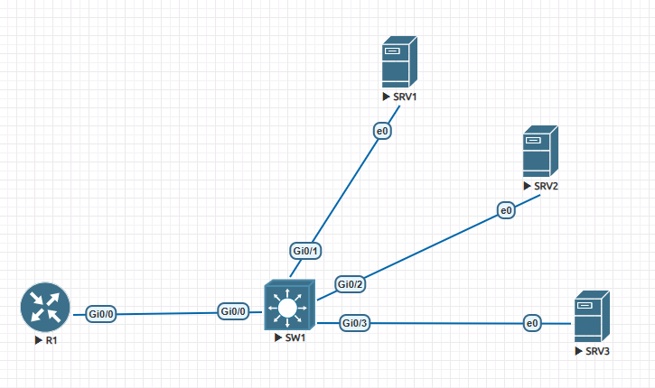
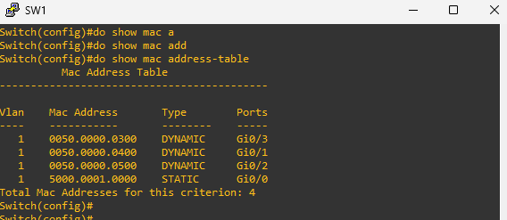

# MAC Address Table Lab

## Lab Overview

This lab demonstrates how a Cisco Layer 2 switch learns MAC addresses dynamically, how MAC address aging works, and how to configure a static MAC address entry.

The lab includes packet capture analysis, MAC address learning, disabling MAC address aging, static MAC address configuration, and verification using Cisco IOS commands.

---

# Lab Objectives

- Understand how a switch learns MAC addresses dynamically.
- Observe broadcast and unicast Ethernet traffic.
- Capture packets between the router and switch.
- Disable MAC address aging.
- Configure a static MAC address.
- Verify MAC address learning using Cisco IOS commands.
- Save and verify the switch configuration.

---

# Lab Topology



---

# IP Addressing

| Device | Interface | IP Address |
|---------|-----------|------------|
| R1 | GigabitEthernet0/0 | 192.168.1.1/24 |
| SW1 | VLAN 1 | 192.168.1.2/24 |
| SRV1 | Ethernet0 | 192.168.1.11/24 |
| SRV2 | Ethernet0 | 192.168.1.12/24 |
| SRV3 | Ethernet0 | 192.168.1.13/24 |

---

# Device Connections

| Device | Interface | Connected To |
|---------|-----------|--------------|
| R1 | G0/0 | SW1 G0/0 |
| SW1 | G0/1 | SRV1 |
| SW1 | G0/2 | SRV2 |
| SW1 | G0/3 | SRV3 |

---

# Lab Tasks

## Task 1 – Start Packet Capture

Start a packet capture on the link between **R1** and **SW1**.

---

## Task 2 – Generate Traffic

Generate Layer 2 and Layer 3 traffic.

Examples:

- Ping SRV1
- Ping SRV2
- Ping SRV3

Observe the ARP and ICMP packets in Wireshark.

---

## Task 3 – Verify Dynamic MAC Learning

Run the following command:

```bash
show mac address-table
```

Verify that the switch dynamically learns the MAC addresses of all connected devices.

---

## Task 4 – Disable MAC Address Aging

```bash
conf t
mac address-table aging-time 0
end
```

Verify:

```bash
show mac address-table aging-time
```

---

## Task 5 – Configure a Static MAC Address

```bash
conf t
mac address-table static 0050.0001.0000 vlan 1 interface GigabitEthernet0/0
end
```

---

## Task 6 – Verify the Configuration

```bash
show mac address-table
```

---

# Configuration Commands

## Disable MAC Address Aging

```bash
conf t
mac address-table aging-time 0
end
```

## Configure Static MAC Address

```bash
conf t
mac address-table static 0050.0001.0000 vlan 1 interface GigabitEthernet0/0
end
```

---

# Verification Commands

```bash
show mac address-table
```

```bash
show mac address-table dynamic
```

```bash
show mac address-table static
```

```bash
show mac address-table aging-time
```

```bash
show running-config
```

---

# Packet Capture

A packet capture was performed between **R1** and **SW1** while generating network traffic.

**Capture File**

- `packet-capture.pcapng`

The capture can be opened using **Wireshark** to analyze:

- ARP Requests and Replies
- ICMP Echo Requests and Replies
- Ethernet Source and Destination MAC Addresses
- Broadcast Frames
- Unicast Frames
- MAC Address Learning Process

---

# Verification

Verify the MAC Address Table after configuring the static MAC entry.

```bash
show mac address-table
```

## Verification Screenshot



### Verification Summary

The output confirms that:

- Dynamic MAC addresses have been successfully learned by the switch.
- A static MAC address has been configured on **GigabitEthernet0/0**.
- The switch correctly distinguishes between **Dynamic** and **Static** MAC entries.
- Layer 2 forwarding is based on the entries stored in the CAM table.

---

# Expected Result

After completing this lab:

- The switch dynamically learns MAC addresses from connected devices.
- MAC address aging is disabled.
- A static MAC address remains permanently associated with the configured interface.
- Packet capture confirms ARP and ICMP communication.
- The MAC Address Table correctly displays both dynamic and static entries.

---

# Key Concepts

- Ethernet Switching
- Layer 2 Forwarding
- CAM Table
- MAC Address Learning
- Dynamic MAC Entries
- Static MAC Entries
- MAC Address Aging
- Broadcast Frames
- Unicast Frames
- Cisco Catalyst Switching

---

# Troubleshooting

If MAC addresses are not learned correctly, verify the following:

```bash
show interfaces status
```

```bash
show vlan brief
```

```bash
show mac address-table
```

```bash
show running-config
```

Check that:

- Interfaces are in the **up/up** state.
- Devices can communicate successfully.
- Traffic has been generated.
- Interfaces belong to the correct VLAN.
- No interface is administratively down.

---

# Files Included

```text
MAC-Address-Table/
├── README.md
├── topology.png
├── packet-capture.pcapng
├── verification-show-mac-address-table.png
├── R1.txt
├── SW1.txt
└── Notes.md
```

---

# References

- Cisco IOS XE Configuration Guides
- Cisco Enterprise Campus Switching Documentation
- IEEE 802.3 Ethernet Standard

---


CCNP Enterprise Study Repository

**Lab:** MAC Address Table Learning and Static MAC Configuration
